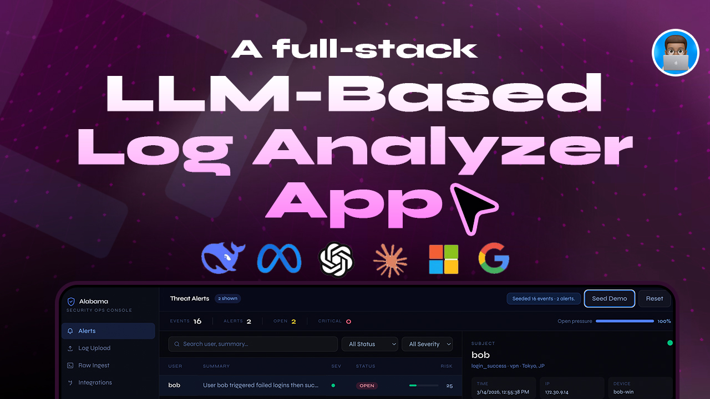

# Project Alabama

Project Alabama is a full-stack, LLM-assisted security analytics app for insider-threat and suspicious activity detection. It ingests enterprise log events, normalizes and stores them in PostgreSQL, runs rule-based detections, and helps analysts investigate findings through a security operations dashboard with Gemini-generated explanations.

## What It Does

Alabama is designed to feel like a lightweight SOC console for demos, prototypes, and portfolio use cases. The app lets you:

- seed realistic demo data for instant exploration
- ingest raw JSON event payloads through an API or UI
- upload log files in multiple formats and convert them into normalized events
- detect suspicious behavior with built-in anomaly rules
- review alerts, related events, notes, and status changes
- generate AI summaries and next-step guidance for alerts and uploaded log batches
- track mock integration connections for providers like AWS, GCP, Azure, GitHub, and Slack

## Core Experience

The main UI is a `Next.js` App Router dashboard with four primary workflows:

- `Alerts`: review alert volume, severity, status, context, related events, and analyst notes
- `Log Upload`: upload a log file and receive parsed event ingestion plus an AI risk summary
- `Raw Ingest`: submit JSON directly to the ingestion API from the browser
- `Integrations`: store connection state metadata for supported providers

The dashboard also supports:

- live refresh polling
- search by alert user or summary
- status and severity filters
- AI model selection with local persistence
- demo seed and reset actions

## Detection Rules

The built-in rule engine currently generates anomalies and alerts from four detection patterns:

1. `OFF_HOURS_PRIVILEGED_ACTION`
   Privileged actions such as `delete`, `download`, `export`, or `privilege_change` performed during the off-hours UTC window (`20:00-06:00`).
2. `IMPOSSIBLE_TRAVEL`
   A successful login from a different geo within two hours of the user's previous successful login.
3. `DOWNLOAD_SPIKE`
   Ten or more `download` or `export` actions by the same user within a 30-minute window.
4. `FAILED_LOGINS_THEN_SUCCESS`
   Three or more failed login attempts followed by a successful login within 20 minutes.

Each triggered rule contributes to a combined risk score, which is mapped to severity:

- `low`
- `medium`
- `high`
- `critical`

## AI Features

Gemini is used in two places:

- alert explanation: turns alert context into a short analyst-style summary with suggested next steps
- upload insight summary: summarizes a processed log file and highlights the top risks found

If the Gemini API key is missing, the model output is malformed, or the request fails, the app falls back to deterministic server-side summaries so the experience still works.

## Tech Stack

- `Next.js 16` with App Router
- `React 19`
- `TypeScript`
- `Prisma ORM`
- `Neon / PostgreSQL`
- `@google/genai` for Gemini integration
- `Tailwind CSS 4`

## Local Setup

### 1. Install dependencies

```bash
npm install
```

### 2. Configure environment variables

Copy `.env.example` to `.env` and provide your database and Gemini credentials.

```bash
DATABASE_URL="postgresql://...-pooler...sslmode=require"
DIRECT_URL="postgresql://...sslmode=require"
GEMINI_API_KEY="your-key"
GEMINI_MODEL="gemini-3-flash-preview"
```

Environment variable notes:

- `DATABASE_URL`: used by the application at runtime
- `DIRECT_URL`: used by Prisma CLI operations such as `prisma db push`
- `GEMINI_API_KEY`: enables LLM-generated explanations and upload summaries
- `GEMINI_MODEL`: optional default model; the UI can also override this per request

### 3. Initialize Prisma

```bash
npm run prisma:generate
npm run prisma:push
```

### 4. Start the app

```bash
npm run dev
```

Open [http://localhost:3000](http://localhost:3000).

## Available Scripts

```bash
npm run dev
npm run build
npm run start
npm run lint
npm run prisma:generate
npm run prisma:push
```

## API Reference

### `POST /api/ingest`

Ingests an array of events or an object with an `events` array.

Accepted body shapes:

```json
[
  {
    "userId": "charlie",
    "eventType": "auth",
    "action": "login_failed",
    "geo": "Berlin, DE",
    "resource": "vpn"
  }
]
```

```json
{
  "events": [
    {
      "userId": "charlie",
      "eventType": "auth",
      "action": "login_success",
      "geo": "Singapore, SG",
      "resource": "vpn"
    }
  ]
}
```

Minimum required fields per event:

- `userId`
- `eventType`
- `action`

Common optional fields:

- `timestamp`
- `deviceId`
- `ip`
- `geo`
- `resource`
- `role`
- `metadata`
- `raw`

### `POST /api/ingest/upload`

Accepts a `multipart/form-data` upload with:

- `file`: the log file to parse
- `model`: optional Gemini model override

Upload constraints:

- max file size: `5 MB`
- supported formats:
  - JSON array or `{ "events": [...] }`
  - NDJSON
  - CSV
  - key/value log lines such as `userId=bob action=download geo="Tokyo, JP"`

The response includes:

- detected file format
- parsed event count
- alert count
- parser warnings
- AI-generated upload insight summary

### `GET /api/alerts`

Returns:

- system stats
- current alerts list

### `GET /api/alerts/:id`

Returns alert context, including:

- linked anomalies
- trigger event metadata
- related events timeline

### `PATCH /api/alerts/:id`

Updates an alert with:

- `status`: `open`, `investigating`, or `resolved`
- `note`: a new analyst note to append

### `POST /api/alerts/:id/explain`

Generates an alert explanation. Optional body:

```json
{
  "model": "gemini-3-flash-preview"
}
```

### `GET /api/integrations`

Lists stored integration connection states.

### `POST /api/integrations`

Upserts an integration connection. Supported providers:

- `aws`
- `gcp`
- `azure`
- `github`
- `slack`

Supported statuses:

- `connected`
- `disconnected`
- `error`

### `POST /api/seed`

Resets the current store and loads demo events.

### `POST /api/reset`

Clears persisted application data.

## Log Parsing Behavior

Uploaded log files are normalized into the app's ingestion shape. The parser is flexible and attempts to map common aliases such as:

- `user`, `user_id` -> `userId`
- `type`, `category` -> `eventType`
- `eventAction`, `event`, `operation` -> `action`
- `time`, `ts` -> `timestamp`
- `device` -> `deviceId`
- `sourceIp` -> `ip`
- `location` -> `geo`
- `target` -> `resource`
- `userRole` -> `role`

Unsupported or incomplete rows are skipped with warnings when possible.

## Data Model

The Prisma schema defines the following main entities:

- `Event`
- `Anomaly`
- `Alert`
- `AlertAnomaly`
- `IntegrationConnection`

Important enums include:

- `EventType`
- `EventAction`
- `AlertStatus`
- `DetectionRule`
- `AlertSeverity`
- `IntegrationProvider`
- `IntegrationStatus`

See `prisma/schema.prisma` for the full model.

## Project Structure

Key files and directories:

- `app/page.tsx`: main dashboard UI
- `app/api/**`: API routes for ingest, alerts, upload, seed, reset, and integrations
- `lib/detection.ts`: core rule engine and risk scoring
- `lib/log-file.ts`: uploaded log parsing and normalization
- `lib/gemini.ts`: Gemini prompts, response parsing, and fallbacks
- `lib/store.ts`: persistence and application data operations
- `prisma/schema.prisma`: database schema

## Development Notes

- Prisma uses PostgreSQL as the datasource.
- Runtime database access uses Neon through `@prisma/adapter-neon`.
- Prisma CLI configuration uses `DIRECT_URL`.
- The alerts API is configured as dynamic to keep dashboard data fresh.
- AI model selection is stored in local browser storage under `alabama:ai:model`.

## Example Use Cases

- demoing a full-stack cybersecurity portfolio project
- testing rule-based anomaly detection on synthetic identity or file activity logs
- experimenting with LLM-assisted incident explanation workflows
- showcasing a modern `Next.js` app with database, API, and AI integration

## Future Improvement Ideas

- authentication and analyst roles
- background job processing for large uploads
- real provider credential flows for integrations
- richer rule configuration and threshold tuning
- charts, trend lines, and alert timelines
- exportable investigation reports
